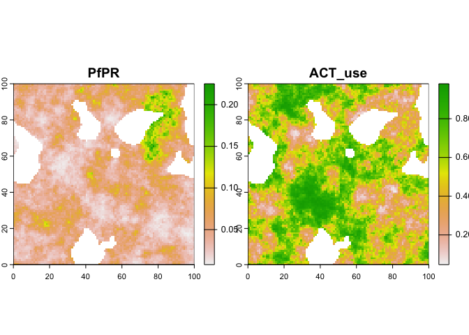
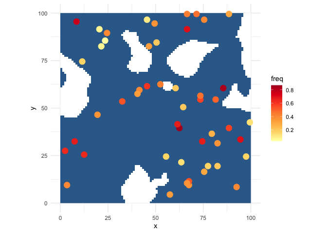

<!-- README.md is generated from README.Rmd. Please edit that file -->

# Mapping ACT treatment failure in Africa

<!-- badges: start -->
<!-- badges: end -->

Spatial modelling of rates of failure of Artemisinin Combination Therapy
(ACT) to treat *Plasmodium falciparum* malaria in Africa, using a
combination of genotypic (marker) and phenotypic (treatment
success/failure) data.

This is currently only a very early prototype. The aim of this analysis
is to use a multi-level and multi-output (latent factor) model-based
geostatistical approach to simultaneously map the frequency of multiple
resistance markers (single neucleotid polymorphisms; SNPs) in the *P.
falciparum* Kelch gene, and the frequency of treatment failure due to
genetic resistance.

## Model

The following model is used to simulate a synthetic dataset for model
testing, and will be implemented as a Bayesian statsitical model to
estimate parameters and predict the prevalence of resistance markers and
phenotypes in \$P.falciparum\* parasites sampled from malaria cases.

The number of failed treatments $F_{i}$ in spatial location (pixel) $i$
is Binomial, with number of attempted treatments $T_{i}$, and per-case
probability (frequency) of treatment failure $P^{TF}_i$:

$$
F_{i} \sim Binomial(T_{i}, P^\text{TF}_i)
$$ The overall probability of treatment failure is calculated from the
individual (ie. conditionally-independent) probabilities of failure due
to each of $S$ different resistance markers (SNPs) $s$, computed as the
product of the probability of treatment failure $q^{TF}_{i,s}$ *if* SNP
$s$ if present, multiplied by the probability (frequency)
$P^{SNP}_{i,s}$ that SNP $s$ is present in a randomly sampled parasite
in pixel $i$ :

$$
P^\text{TF}_i = 1- \prod_{s=1}^S{1 - q^\text{TF}_{i,s} P^\text{SNP}_{i,s}}
$$ We additionally model observations of the number of samples positive
for each of these SNPs $\text{SNP}^{+}_{i,s}$ at each pixel $i$ via a
Binomial likelihood of the number of samples tested for this SNP
$\text{SNP}_{i,s}$ and the population frequency $P^\text{SNP}_{i,s}$ of
the SNP in pixel $i$ : $$
\text{SNP}^{+}_{i,s} \sim Binomial(\text{SNP}_{i,s}, P^\text{SNP}_{i,s})
$$ The frequencies of the vector of SNPs $P^\text{SNP}_{i}$ at each
pixel $i$ is jointly modelled as the outcome of a random-slopes, latent
factor model-based geostatistical model with logit link function:

$$
\text{logit}(P^\text{SNP}_{i,s}) = \mathbf{X}_i \beta_s + \sum_{l=1}^{L}\Lambda_{s,l} \epsilon_{i,l} \\
\beta_{s,k} \sim N(\mu_k, \sigma^{2}_k)
$$ where $\mathbf{X}$ is a design matrix of $K$ observed spatial
covariates of SNP frequencies (including a dummy column for an intercept
term), with the vector $\mathbf{X}_i$ representing the covariates values
at location (pixel) $i$, and $\beta_s$ is corresponding vector of $K$
regression coefficients for SNP $s$, each element $k$ of which is drawn
from a hierarchical distribution (random slopes model), with average
coefficient across all SNPs $\mu_k$, and between-SNP variance
$\sigma^{2}_k$. This enables us to capture the similar-but-different
relationships between the spatial covariates and each SNPs.

In addition to these covariate effects, additional spatial structure is
modelled via $L$ vectors of latent spatial factors $\epsilon_l$, each
SNP $s$ having loading coefficients $\Lambda_{s,l}$ against each one of
these latent factor $l$. By setting $L<S$, this latent factor modelling
approach enables us to parsimoniously model each SNP as having a
separate spatial random effect, but with correlation between the
residual spatial patterns of each SNP, reflecting their shared
(unobserved) drivers. The number of latent factors $L$ is a modelling
choice that can be determined by model criticism; by determining how
varied the different SNP patterns need to be (the minimum number of
latent factors required) to explain the data reasonably well.

Finally, we model each of the spatial latent factors as an independent
zero-mean Gaussian spatial process, with covariance matrix $K$, shared
across all spatial latent factors:

$$
\epsilon_{s} \sim \text{GP}(\mathbf{0}, K)
$$

## Covariates

We include as covariates several spatial estimates of factors expected
to drive the emergence of and selection for the presence of resistance
markers. We initially include the estimated prevalence of *Plasmodium
falciparum* malaria among the under-5s in each pixel (*Pf*PR), and the
proportion of malaria cases that seeking and access ACTs. Probability of
using an ACT is expected to predict the emergence and increasing
frequency of resistance markers in a fairly straightforward positive
relationship by decreasing survival of non-resistant parasites. Parasite
prevalence is expected to predict the frequency of resistance markers in
two opposing ways. Low parasite prevalence is expected to increase the
likelihood of establishment of *de novo* resistance markers since low
prevalence likely corresponds to low genetic diversity, and prevents the
markers from being diluted or bred out of the population. Conversely,
high parasite prevalence corresponds to high rates of transmission,
which accelerate the rate of proliferation of established mutations. We
can therefore model this non-monotonic relationship via a quadratic
function (e.g. via an additional covariate term for squared *Pf*PR), or
similar non-linear functional form.

## Priors

We will consider a range of priors for model parameters when fitting the
model, and evaluate their impact and suitability against the data using
prior and posterior predictive checks.

### Mapping from SNPs to treatment failure

A number of options are available to construct a prior over the
probability of treatment failure, conditional on SNP presence
$q^\text{TF}_{i,s}$, and these depend on the level of pre-filtering of
relevant SNPs to model, and the availability of external information to
inform the model.

#### GWAS prior

In the event a large number of SNPs are included, and little prior
information is available to determine which are most informative, a
reasonable choice might be a positive-truncated Cauchy distribution,
constrained to the unit interval. Similar to that used in a Bayesian
genome-wide association study (GWAS), this regularising prior encodes
the expectation that most associations between SNPs and phenotypes will
be zero (hence a large probability mass close to zero), but that a few
will have a significant effect. The heavy upper tail of this
distribution minimises the downward bias (shrinkage) of the few SNPs
that are predictive of treatment failure, relative to alternative
choices such as a truncated normal.

#### Diffuse prior

If the SNPs included for modelling are pre-selected for known strong
association with treatment failure, a more appropriate and less-biasing
prior might be more diffuse; for example a standard uniform (equal
probability on all values between 0 and 1).

#### Informative prior

If quantitative estimates of the associations between SNPs and treatment
failure is available from previous studies, these could be used to
construct informative priors over the parameters. However this would
only be viable if: the estimates are available form the same study for
all SNPs considered; the assoiations are estimate with the same
funcitonal form for combining multiple markers as in this model; and the
estimates were made from data not included in the spatial estimation in
our study. If these requirements are met, the informative priors could
be implemented as normal distributions, truncated to the unit interval,
with parameters chosen to closely match the estimate and its standard
error to the truncated distribution’s mean and standard deviation
(noting that these are different from the untruncated mean and standard
deviation, and may need to be solved-for numerically).

## Preferential sampling

We assume that the spatial locations of data on SNP frequencies are
spatially biased towards areas with higher frequencies of treatment
failure - and therefore higher frequencies of resistance markers. This
reflects the likely scenario that sequencing of parasites is often
performed to investigate the (genetic) causes of observed (phenotypic)
treatment failure. Failing to account for this would bias-up estimates
of marker frequencies. We account and correct for this bias by
simultaneously fitting to both spatial SNP and treatment failure
datasets. The equation relating SNP frequencies to treatment failure
probabilities ensures that low frequencies of treatment failure indicate
low frequencies of resistance markers (when $P^\text{SNP}_{i,s}$ are
close to zero, $P^\text{TF}_i$ must be close to zero), informing the
model of these low-frequency regions and correcting the bias.

We currently assume that the spatial locations of treatment failure data
are not biased (within the study area) to areas of higher treatment
failure. This assumption would be met if data were collected across the
study area to accurately estimate the levels of treatment failure.
Hoewver it would be violated if treatment failure data were collected as
a by-product of sampling targeted towards high-failure-rate locations,
e.g. to understand mechanisms of resistance. If we determine that the
latter scenario is more likely, we could implement a preferential
sampling model (after Diggle) to correct for this bias, by additionally
modelling the spatial locations of treatment failure data as an
inhomogenous Poisson point process, with intensity modelled as a
monotonic increasing function of the modeled failure rate
$P^\text{TF}_i$. This preferential sampling model would therefore
interpret areas with fewer treatment failure datapoints as likely to
have a lower probability of treatment failure; an assumption that may or
may not reasonable.

## Example

Simulate and plot some synthetic data

``` r
library(tidyverse)
library(terra)
sims <- sim_dataset()
#> ℹ Initialising python and checking dependencies, this may take a moment.✔ Initialising python and checking dependencies ... done!               

# fake covariates
plot(sims$data$covariates)
```

<!-- -->

``` r

# simulated treatment failure data
sims$data$tf_data %>%
  mutate(freq = failed / treated) %>%
  ggplot(
    aes(
      x = x,
      y = y,
      alpha = freq,
    )
  ) +
  geom_point(size = 5) +
  theme_minimal()
```

<!-- -->

``` r

# simulated SNP data
sims$data$snp_data %>%
  mutate(freq = positive / tested) %>%
  ggplot(
    aes(
      x = x,
      y = y,
      alpha = freq,
      group = snp
    )
  ) +
  geom_point(
    size = 2
  ) +
  facet_wrap(~snp) +
  theme_minimal()
```

<!-- -->
